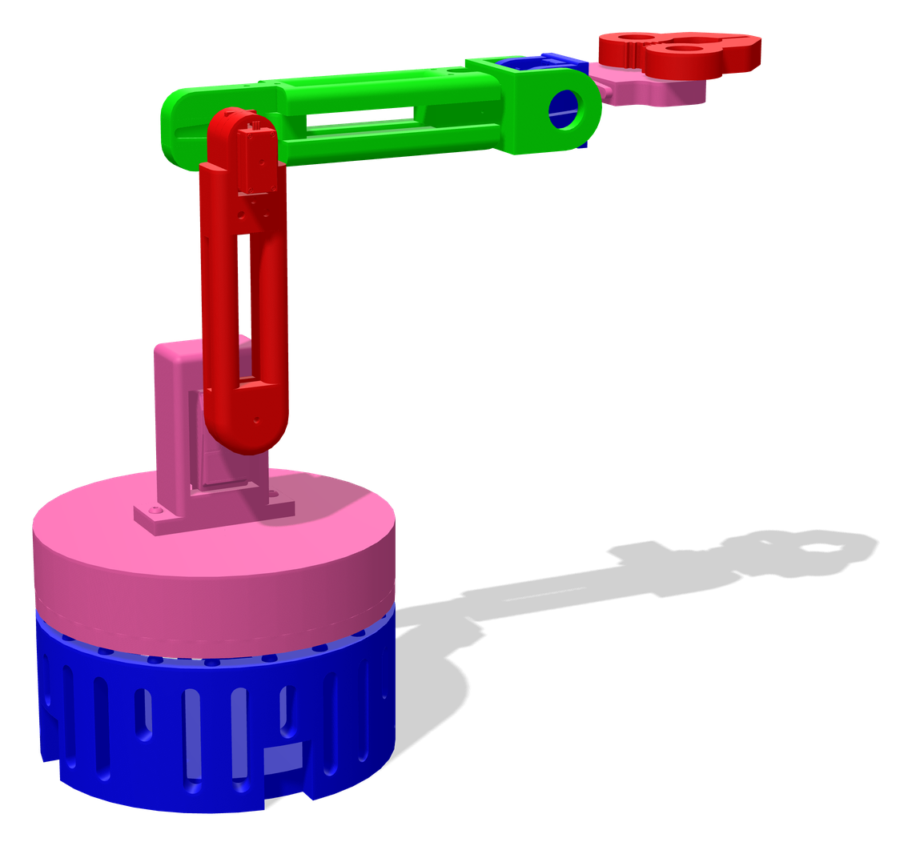
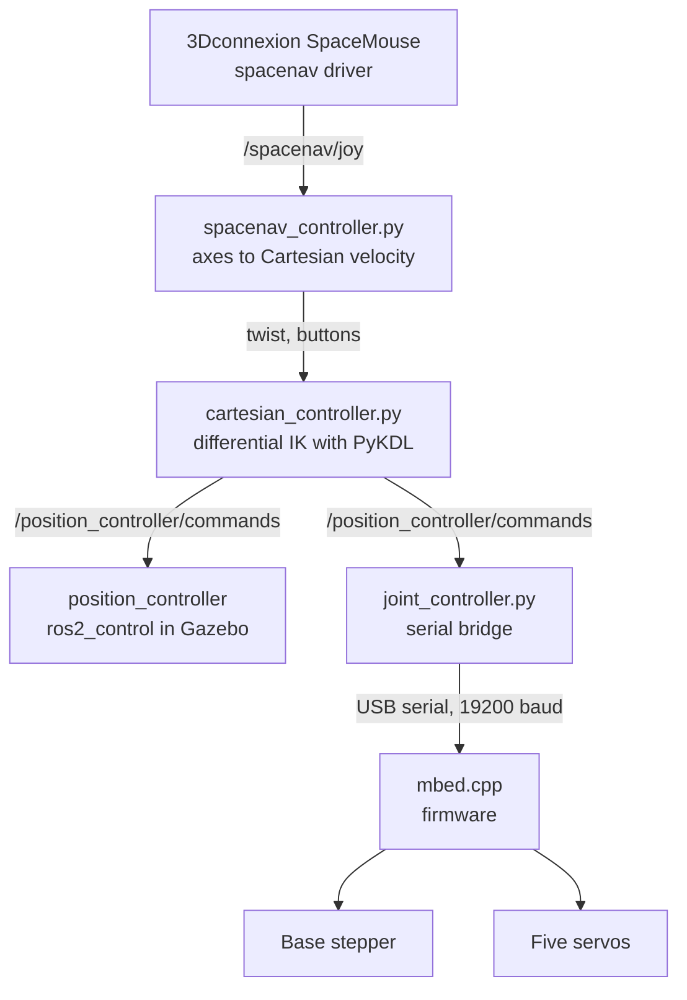

# jmbot

**A five-axis robot arm with a gripper, teleoperated in Cartesian space with a 3D mouse. Built with ROS 2, Gazebo and Mbed.**

<p align="center">
  
</p>

<!-- TODO: add the thesis title, the supervisor, a link to the thesis PDF,
     and a photo or video of the real arm. -->

jmbot is the robot arm I designed and built for my bachelor's thesis at Universidad Carlos III de Madrid (UC3M) in 2025. This repository holds its ROS 2 package and its firmware. The same software drives a Gazebo simulation of the arm and the real hardware:

- A URDF model built from the CAD meshes, simulated in Gazebo with `ros2_control`.
- Cartesian teleoperation. A 3Dconnexion SpaceMouse sets the velocity of the tool, and a differential inverse-kinematics controller turns it into joint positions.
- A serial bridge and Mbed firmware that move the real motors: a stepper for the base and five servos for the other joints and the gripper.

## How it works



1. The `spacenav` driver publishes the six axes and two buttons of the mouse on `/spacenav/joy`.
2. `spacenav_controller.py` scales the axes into a Cartesian velocity command and publishes it as a `Twist` at 100 Hz. Pushing the mouse all the way asks for about 100 mm/s. The two buttons open and close the gripper.
3. `cartesian_controller.py` holds the kinematic chain of the arm in PyKDL. For every command it solves the differential inverse kinematics with the pseudo-inverse of the Jacobian, integrates the joint velocities over a 10 ms step and publishes the new joint positions. A step that would take a joint past its limit is discarded.
4. The joint positions go out on `/position_controller/commands`. Two consumers can listen to that topic at the same time:
   - In simulation, a `ros2_control` position controller running inside Gazebo.
   - On the real arm, `joint_controller.py`, which converts the positions to degrees and sends them over USB serial to the microcontroller.
5. The firmware in `mbed.cpp` parses each frame, steps the base motor and sets the servo angles.

## The arm

| Joint | Motion | Actuator | Firmware pins | Joint in the URDF |
| --- | --- | --- | --- | --- |
| 1 | Base rotation | Stepper motor, 0.9° per step, through a 58:19 gear reduction | STEP `D4`, DIR `D7` | `Base_base` |
| 2 | Shoulder | Servo | `D9` | `Base_hombro` |
| 3 | Elbow | Servo | `D5` | `Hombro_medio` |
| 4 | Wrist pitch | Servo | `D3` | `UNION_MUNECA` |
| 5 | Wrist roll | Servo | `D6` | `muneca_pinza` |
| Gripper | Open and close | Servo | `D10` | `pinza_final` |

### Kinematic model

`cartesian_controller.py` builds the chain from these Denavit-Hartenberg parameters (lengths in mm):

| Joint | a | α | d | θ offset |
| --- | --- | --- | --- | --- |
| 1 | 0 | −90° | 140 | 0° |
| 2 | 106 | 0° | 0 | −90° |
| 3 | 140 | 0° | 0 | +90° |
| 4 | 0 | +90° | −28 | +90° |
| 5 | 0 | 0° | 70 | 0° |

With every joint at zero, the tool sits at (210, −28, 246) mm from the base origin.

### Serial protocol

Each command is one ASCII frame: `<`, six signed three-digit angles in whole degrees, and `>`.

```
<+090-045+030+000+012+100>
```

The values are, in order, base, shoulder, elbow, wrist pitch, wrist roll and gripper. `joint_controller.py` sends the frames at 19200 baud on `/dev/ttyACM0`.

## Repository layout

| Path | Contents |
| --- | --- |
| `urdf/model.urdf` | Robot description: links, joints, inertias and the `ros2_control` position interfaces |
| `urdf/meshes/` | Meshes exported from the CAD model |
| `launch/jmbot.launch.py` | Starts Gazebo with an empty world, spawns the arm and loads the controllers |
| `config/controller.yaml` | `ros2_control` configuration: a joint state broadcaster and a position controller for the six joints |
| `scripts/spacenav_controller.py` | SpaceMouse input to Cartesian velocity and gripper commands |
| `scripts/cartesian_controller.py` | Differential inverse kinematics and joint-limit check |
| `scripts/joint_controller.py` | Bridge from joint commands to the serial protocol |
| `scripts/prueba.py` | Stand-alone forward and inverse kinematics check of the chain |
| `mbed.cpp` | Mbed OS firmware for the stepper and the servos |

## Running it

Requirements:

- ROS 2 with Gazebo: `ros_gz_sim`, `ros_gz_bridge`, `gz_ros2_control`, `ros2_control`, `ros2_controllers`, `robot_state_publisher` and `xacro`.
- The `spacenav` ROS package and the `spacenavd` daemon, for the 3D mouse.
- PyKDL (`python_orocos_kdl_vendor`), NumPy and `pyserial`.
- For the real arm, a board running Mbed OS 6 and the Mbed `Servo` library.

Build the package in a ROS 2 workspace:

```bash
mkdir -p ~/ros2_ws/src && cd ~/ros2_ws/src
git clone https://github.com/josematocremaa/jmbot.git
cd ~/ros2_ws
rosdep install --from-paths src --ignore-src -r -y
colcon build --packages-select jmbot
source install/setup.bash
```

Start the simulation:

```bash
ros2 launch jmbot jmbot.launch.py
```

To move the simulated arm without a 3D mouse, publish joint positions in radians:

```bash
ros2 topic pub --once /position_controller/commands std_msgs/msg/Float64MultiArray \
  "{data: [0.5, 0.3, -0.3, 0.0, 0.0, 0.0]}"
```

To teleoperate it, run each of these in its own terminal:

```bash
ros2 run spacenav spacenav_node
ros2 run jmbot spacenav_controller.py
ros2 run jmbot cartesian_controller.py
```

To drive the real arm with the same commands, flash the firmware, connect the board over USB and start the serial bridge from the workspace root:

```bash
python3 src/jmbot/scripts/joint_controller.py
```

### Firmware

`mbed.cpp` is the `main.cpp` of an Mbed OS 6 project. Add the Mbed `Servo` library to the project, build it for your board and flash it. The pin assignment is in the table above.

## Credits

- The package skeleton and the launch file started from the [`gz_ros2_control_demos`](https://github.com/ros-controls/gz_ros2_control) examples, which are licensed under Apache-2.0.
- The kinematics use [Orocos KDL](https://github.com/orocos/orocos_kinematics_dynamics) through its Python bindings.

## License

MIT. See [LICENSE](LICENSE). The launch file keeps its original Apache-2.0 header.

## Author

José Manuel Merlo Sánchez ([LinkedIn](https://www.linkedin.com/in/jose-manuel-merlo-sanchez-545507241)). This was my final thesis for the Bachelor's Degree in Industrial Electronics and Automation Engineering at Universidad Carlos III de Madrid, 2025.
